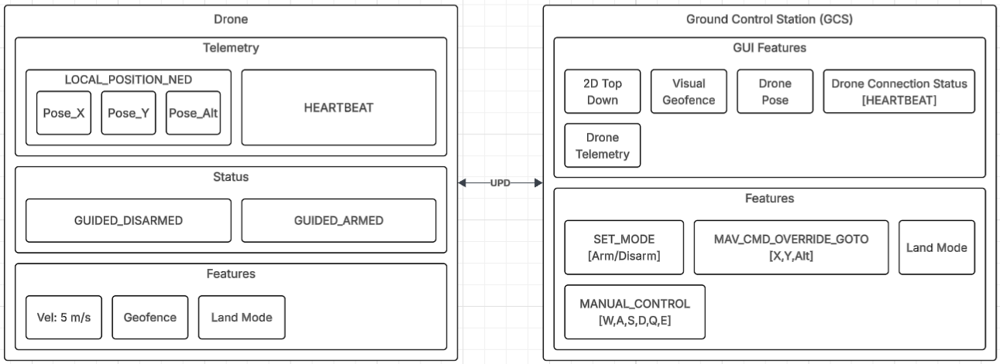
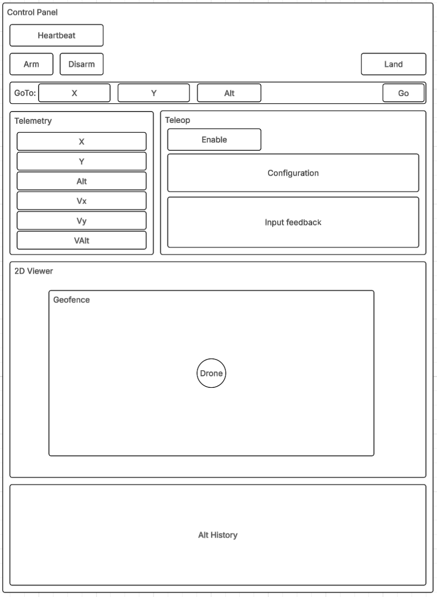
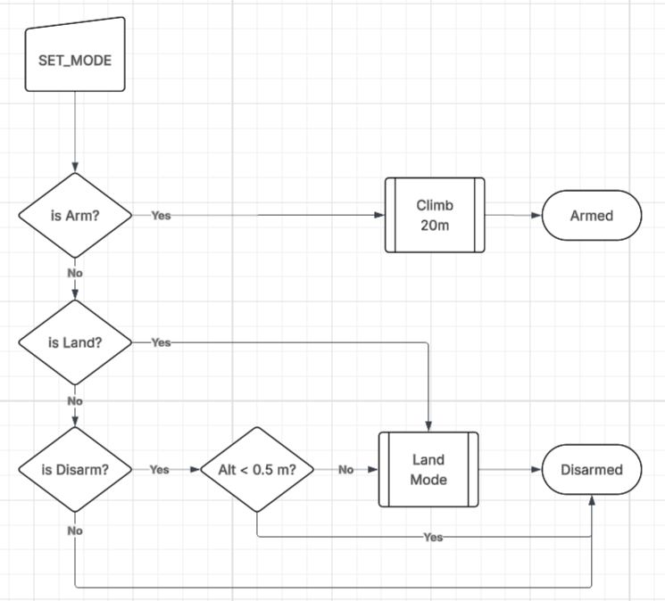

# Krattworks Tech Challenge
A simple UDP client-server drone application with a simulated drone client, ground control staion server and gui to control the available services.

## Tested Platform
- Ubuntu 22.04 (WSL2 on Windows 11)

## Prerequisites
- C++ 20
- g++ >= 11.4.0

## Submodules
- [SimpleUDP](https://github.com/RedFox20/SimpleUDP.git)
- [GLFW](https://github.com/glfw/glfw.git)
- [ImGui](https://github.com/ocornut/imgui.git)
- [MAVLink C Library v2](https://github.com/mavlink/c_library_v2.git)
- [Google Test](https://github.com/google/googletest.git)

### Clone with submodules
```
git clone --recurse-submodules https://github.com/josephjoel3099/krattworks_challenge.git
```

## Build Instructions
```
cd krattworks_challenge
mkdir build
cd build

cmake .. -DCMAKE_CXX_COMPILER=g++
cmake --build .
```

## Run
In a new terminal
```
cd krattworks_challenge/build
./Drone
```
in another teminal
```
cd krattworks_challenge/build
./GCS
```

## Run unit test
```
cd build
ctest
```

## Notes
### Initial planning

<p align="center">

</p>

<p align="center">

</p>

### Architecture
- The simulated drone, mavlink parsing and the GCS gui are separate threads that can run independantly.
- The drone hosts the steps in operations like arm, disarm, land and the GCS gui only triggers an action, this means even if the connection is lost after trigger the drone safely caries out the last command.
- The simulated drone stops immediately at the edge of the geofence. A real drone will need a padding at which the halt will be triggered so it does not pass the fence. 
- Disarm is the default fallback for SET_MODE. If an unknown command is sent the drone safely disarms. The other alternative would be to ignore unknown command. Both design choices were considered but the former was implemented.

<p align="center">

</p>

- An altitude fence was not set for this simulated drone. This means the drone can climb unlimited using manual control. This could be a specification or limitation in a real drone.
- Configs of the drone are chosen without considering physical constraints of hardware. If a specific hardware is mentioned the configs can be matched.

### Useful links
- [SimpleGCS](https://github.com/Sanmopre/Simple_GCS)
- [LucidChart](https://www.lucidchart.com/pages)

### Further steps
- Doxgen doc for better understanding of the code.
- More fine tunning for better time efficiency and resource usage.
- Connect to physics based sim instead of dum sim drone.
- CI/CD with automated tests on Github.
- Conainerize to match deployment platform.

## GCS Panel

<p align="center">

</p>

## License
MIT License

Copyright (c) 2026 Joseph Joel

Permission is hereby granted, free of charge, to any person obtaining a copy
of this software and associated documentation files (the "Software"), to deal
in the Software without restriction, including without limitation the rights
to use, copy, modify, merge, publish, distribute, sublicense, and/or sell
copies of the Software, and to permit persons to whom the Software is
furnished to do so, subject to the following conditions:

The above copyright notice and this permission notice shall be included in all
copies or substantial portions of the Software.

THE SOFTWARE IS PROVIDED "AS IS", WITHOUT WARRANTY OF ANY KIND, EXPRESS OR
IMPLIED, INCLUDING BUT NOT LIMITED TO THE WARRANTIES OF MERCHANTABILITY,
FITNESS FOR A PARTICULAR PURPOSE AND NONINFRINGEMENT. IN NO EVENT SHALL THE
AUTHORS OR COPYRIGHT HOLDERS BE LIABLE FOR ANY CLAIM, DAMAGES OR OTHER
LIABILITY, WHETHER IN AN ACTION OF CONTRACT, TORT OR OTHERWISE, ARISING FROM,
OUT OF OR IN CONNECTION WITH THE SOFTWARE OR THE USE OR OTHER DEALINGS IN THE
SOFTWARE.
